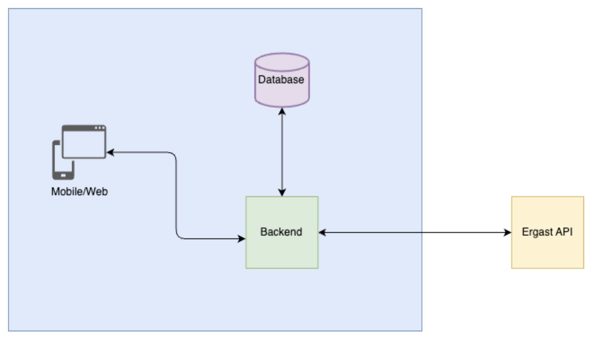
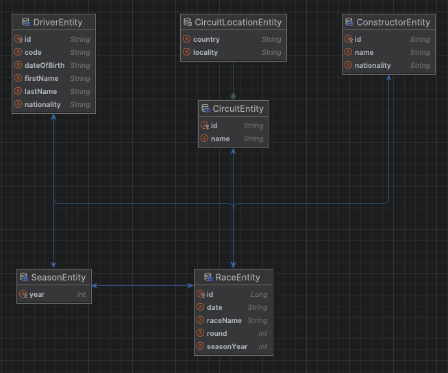
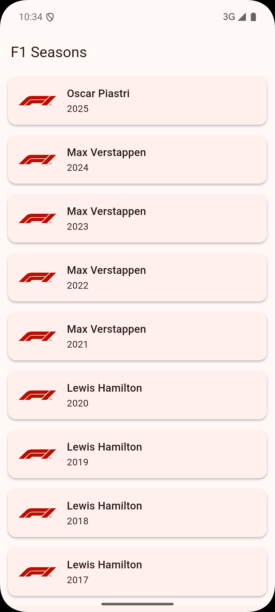
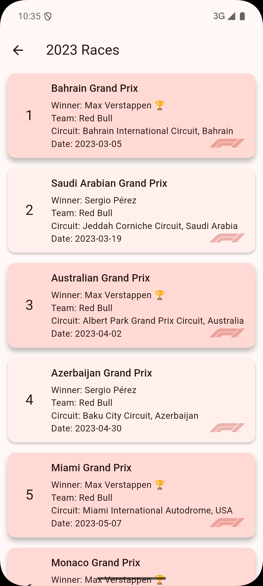
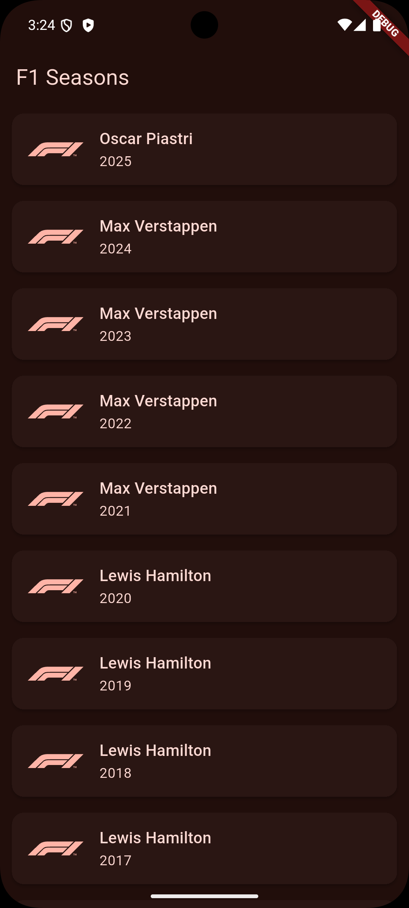
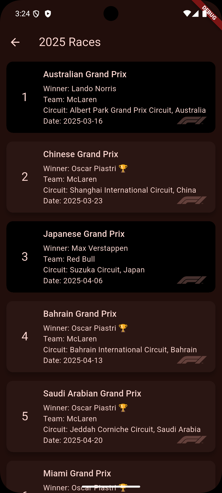

# Full stack Assignment

# Backend
## Implementation details
The backend is implemented in Spring boot and Kotlin and needs to link to a Postgres Database instance.

The overall architecture of the application is exactly the same as suggested in the assignment document.

The application, when it starts, also tries to fetch records from the Ergast Api from the year configured in env variables.

The service is not bound to the year 2005. The starting year depends on the start value configured in the application for initialization, and then the api can also request for years starting from 1950.

For the sake of the demo, the "spring.jpa.hibernate.ddl-auto" is set to "create-drop". Which means as soon as the server is shut down it will wipe all cache data. This can be changed to "update" to retain cache across server sessions.

### Rest Api
The service exposes the OpenApi specs document that can be accessed using http://localhost:8080/swagger-ui/index.html if hosted locally. Otherwise, replace localhost:8080 with the hosted domain.   
I will give a little overview of the service. It exposes two api end points
- **GET "/api/v1/seasons?"**
  - This api takes two optional parameters, **from** and **to**. 'From' and 'two' both are optional parameters. 'From' has a default value of 2005. 'To' if not sent takes the value of current year.
  - Validations are also in place for a minimum and maximum value using Spring Validation. 
  - The validation that 'from' has to be less than 'to' is manually checked in code as for configuring this using Spring Validation annotation required changing request parameters from Url to a body JSON object. I don't think that would be a good practice.
- **GET /api/v1/seasons/{year}/races**
  - This api requires 'year' as a path variable that is not an optional parameter.
  - Here again, Spring Validations are in place to check request validity.
### Cache
The cache layer is implemented using Spring data JPA backed by a Postgres SQL database, which is being exposed by the Cache repository.

### Testing
Extensive **Unit tests** are implemented for all the layers of the service.
### CI/CD
- The pipeline has been implemented using the GitHub Actions with flow: install → lint → test → build → deploy
- The deployment stage uploads the Docker image to the Docker hub public repository.

## How to run?
- In the infrastructure directory create a '.env' file according to the instructions mentioned in '.env-example'
- Run "docker-compose up"
### Run locally
- To run locally, open the project in IntelliJ IDEA Ultimate.
- Run a Postgres instance either locally or through a docker image.
- Add environment variables mentioned in the 'infrastructure/.env-example' to either Intellij Application configuration or the OS. You don't need to add the Docker username and repository, only the rest.
- run the application.

# Frontend
 

 

## Implementation Details
The frontend of the application is implemented in Flutter.

The implementation is inspired from **[Clean Architecture](https://blog.cleancoder.com/uncle-bob/2012/08/13/the-clean-architecture.html)** and is divided into three layers i.e., presentation, domain, data. I have also tried to add proper separation of concerns using abstractions where ever I could, following dependency inversion, along with separate models and mappers between layers if there are any differences between models.

The following are the features implemented;
1. The UI consists of two screens i.e., Seasons with champions and races in a season
   - **Seasons with champions**: This is a simple list of clickable seasons starting from the year you set in the app build-time configuration to the current year. Clicking on the item takes you to the Races in that season
   - **Races in a season**: This screen consists of a list of all the races in the selected season. The race in which the champion of the season won has higher elevation and contains a small trophy against the race winner's name.
2. The profile data is persisted in **sqflite** in the cache package of the data layer.
3. Api access through **OpenApi dart generator**
   - The data for the seasons and the races is fetched using ApiClient generated using OpenApi dart generator and included as a separate lib under frontend/packages/f1_api_client. The api client is then exposed to the application though a remote data-source in the data layer.
   - You will also find **the generate_api.sh** script in the frontend folder along with **frontend/packages/f1_api_client/openapi.json**. These can be used to generate the api client again in case the back end changes. 
4. All the project dependencies are injected using Providers
5. Extensive **Unit tests** are also implemented
6. CI/CD Pipeline
   - The pipeline has been implemented using the GitHub Actions with flow: install → lint → test → build → deploy
   - Both the android and iOS artifacts can be accessed from the GitHub release.
   - The Android apk can be installed in an emulator on a machine running the backend on localhost to run the application
   - For the iOS, unfortunately, to distribute the application, you need a paid developer's account. Only then you can configure signing and distribute on test flight. Which was not possible, hence I just created a runner and uploaded that as an artifact. But you can run locally and test on iOs as well.  
7. **Dark Theme** supported

## How to run?
- Have the backend running on localhost. 
- Download the apk from the GitHub releases and install it in an emulator.
### Run locally
- To run locally, you have to create an **env.json** containing two parameters. 
- You will find an **env-example.json** that explains what should be present in the file.
- Please keep in mind that to access localhost, you can access it through http://localhost:8080 for iOS, but for android you need to set the path to http://10.0.2.2:8080. 

